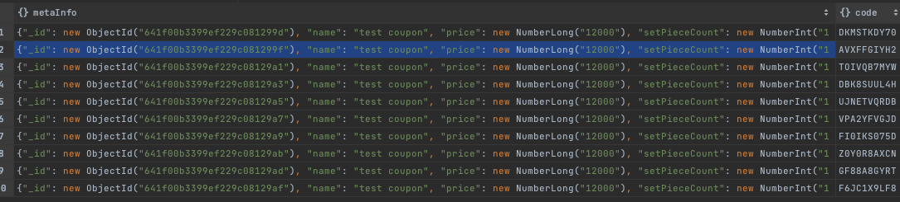

# study-idleworld-coupon

### week3
도메인을 정의한다.
1. 쿠폰
2. 쿠폰메타
3. 쿠폰 이벤트
4. 멤버 (사용자)

### week5
#### 목표
일단 for문으로 운영자가 입력한 쿠폰 개수, 쿠폰 메타정보로 쿠폰을 몽고db에 발급한다.
이제 사용자에게 할당하기 위한 redis config 및 repo test code를 작성한다.

#### week5 결과


```
curl --location 'localhost:8080/coupon' \
--header 'Content-Type: application/json' \
--header 'Cookie: JSESSIONID=3762A824F829C57B05AF04D68A8FBF6C' \
--data '{
"name" : "test coupon",
"price" : 12000,
"setPieceCount" : 10,
"expiredPeriodUnit" : "DATE",
"expiredPeriodNumber" : 10,
"couponGrade" : "UNIQUE",
"count" : 10
}

```


#### redis
분산락 ( distributed lock ) 을 이용해서 선착순 할당이 동시에 처리되지 않고 단 1개만 처리될 수 있도록 한다.

##### 레디스 사용 이유
레디스에 쿠폰을 발급하지 않고 mongodb에 발급하는 이유
1. 메모리 이슈 https://engineering.linecorp.com/ko/blog/LINE-integrated-notification-center-from-redis-to-mongodb

##### 레디스 전략
1) write through
2) lazy
https://velog.io/@korea3611/Spring-boot-%EC%A2%8B%EC%95%84%EC%9A%94%EC%88%98-%EC%A6%9D%EA%B0%80-%EB%B6%84%EC%82%B0%EB%9D%BD%EC%9D%84-%EC%9D%B4%EC%9A%A9%ED%95%98%EC%97%AC-%EB%8F%99%EC%8B%9C%EC%84%B1-%EC%A0%9C%EC%96%B4%ED%95%98%EA%B8%B0-redis%ED%99%9C%EC%9A%A9%ED%95%98%EA%B8%B0

##### redis config
https://blog.naver.com/semtul79/222235108317
https://devoong2.tistory.com/entry/Spring-Redisson-%EB%9D%BC%EC%9D%B4%EB%B8%8C%EB%9F%AC%EB%A6%AC%EB%A5%BC-%EC%9D%B4%EC%9A%A9%ED%95%9C-Distribute-Lock-%EB%8F%99%EC%8B%9C%EC%84%B1-%EC%B2%98%EB%A6%AC-1

##### redis repository
https://sabarada.tistory.com/106?category=856943

##### 할당 전략
1. 대기열에 쿠폰 발급 사용자를 저장하고
2. 대기열 순위를 조회해 자기가 몇등인지 알 수 있게 한다.
3. 대기열에 있는 사람에게 순서대로 쿠폰을 할당한다.

아래 블로그를 참고한다.
https://jgrammer.tistory.com/m/entry/Redis%EB%A5%BC-%ED%99%9C%EC%9A%A9%ED%95%9C-%EC%84%A0%EC%B0%A9%EC%88%9C-%EC%BF%A0%ED%8F%B0-%EB%B0%9C%EA%B8%89-%EC%84%9C%EB%B2%84-%EC%84%A4%EA%B3%84
https://velog.io/@ddhyun93/Kotlin-Spring-Boot-Redis-Distributed-Lock-%ED%99%9C%EC%9A%A9-%EC%84%A0%EC%B0%A9%EC%88%9C-%EC%9D%91%EB%AA%A8-%EC%8B%9C%EC%8A%A4%ED%85%9C-%EA%B0%9C%EB%B0%9C
